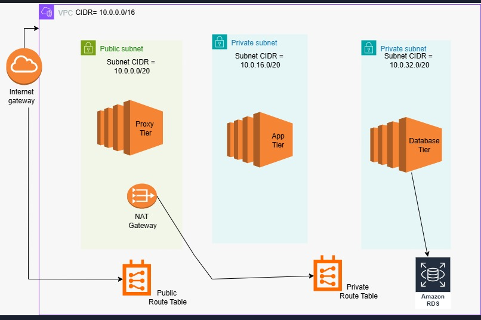
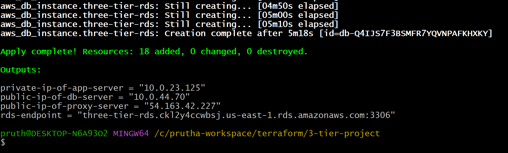
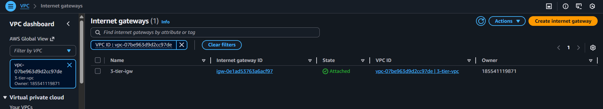
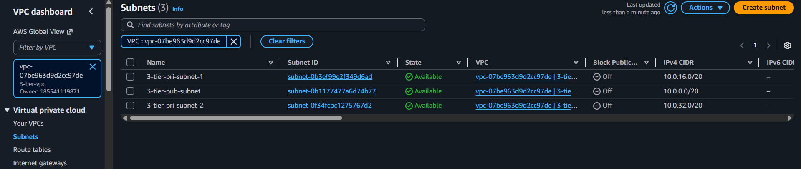
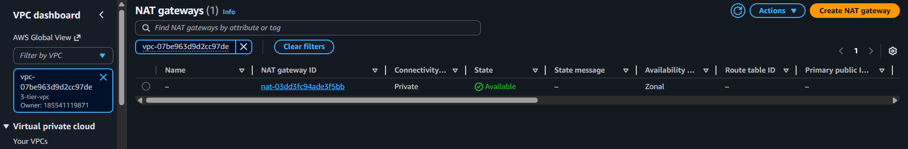
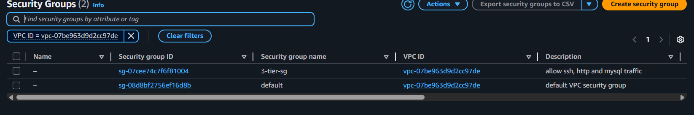
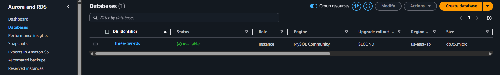

# 3-tier-architecture-using-terraform

---

### This project provisions a complete Three-Tier Architecture on AWS using Terraform.
It includes:
- VPC
- Public & Private Subnets (Multi-AZ)
- Internet Gateway
- NAT Gateway
- Route Tables
- EC2 Instances (Proxy, App, DB)
- RDS MySQL in Private Subnets
- Security Groups
- Remote S3 Backend

The infrastructure is fully created using Terraform.

---

# ➤ Architecture


---

## Output
After successful deploy, Terraform prints:

- Public IP of proxy server

- Private IP of app server

- Private IP of DB server

- RDS Endpoint



---

## VPC
- CIDR: 10.0.0.0/16

- Custom, isolated virtual network


---

## Internet gateway
- Enables internet access for public subnets



---

## Subnet
- 1 Public Subnet

- 2 Private Subnets 



---

## Route Table


---

## Main Route Table
- Routes 0.0.0.0/0 → Internet Gateway


---

## Private Route Table
- Routes 0.0.0.0/0 → NAT Gateway


---

## Nat Gateway
- Allows private instances to reach the internet (yum/apt updates)

- Prevents incoming public traffic



---

## Security Group
Allows:

- SSH (22)

- HTTP (80)

- MySQL (3306)



---

## RDS
- Engine: MySQL 8.0

- Instance type: db.t3.micro

- Multi-AZ subnet group

- Not publicly accessible

- Placed inside private subnets



---

# ➤ How to Deploy

1. Clone my git repo
```
git clone <git-repo-url>
```

2. Initialize Terraform
```
terraform init
```

3. Validate
```
terraform validate
```

4. Plan
```
terraform plan
```

5. Apply
```
terraform apply -auto-approve
```

# ➤ Destroy Infrastructure
```
terraform destroy
```

---

# ➤ Conclusion

This project demonstrates a fully functional AWS 3-Tier Architecture built entirely using Terraform.
It is production-ready and follows AWS best practices like:

- private database layers


---